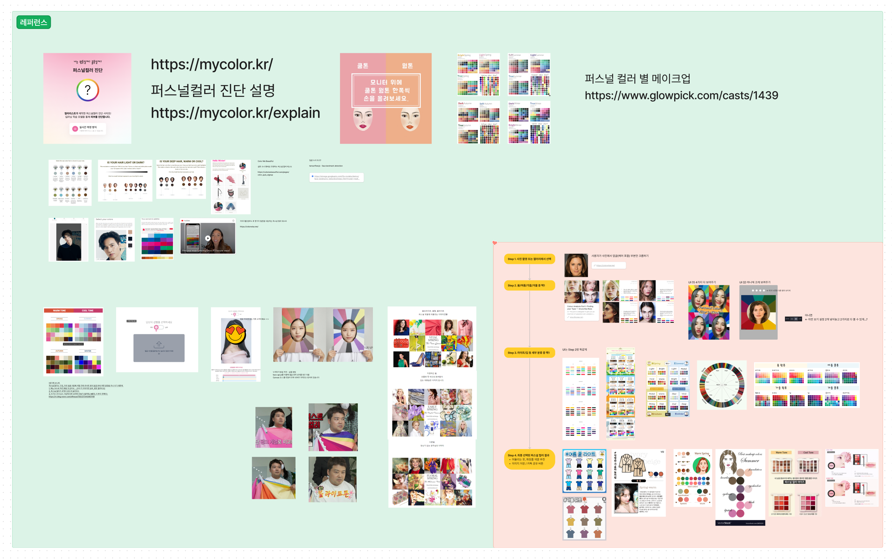
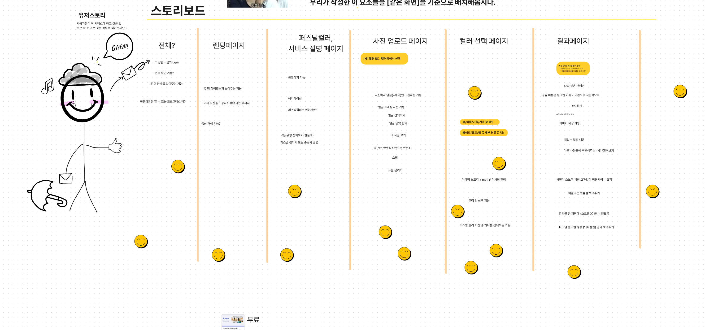
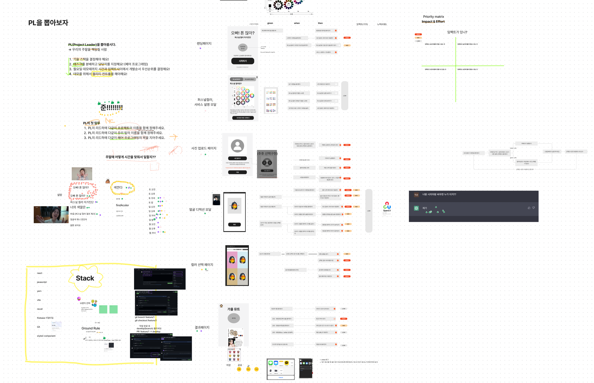

<p align="center">
  <a href="https://omct.web.app/" rel="noopener" target="_blank"></a>
</p>

<h1 align="center">오빠! 톤 많아?</h1>

## About Project

_오빠 톤 많아? 퍼스널컬러 자가진단_

<p>
안녕하세요. 10조 색깐다입니다.

내 퍼스널 컬러는 뭘까? 한 번쯤 궁금한 적 있지 않나요?<br>
하지만 퍼스널 컬러 진단 받으러 가려면 비싸고... 귀찮죠.<br>
내 사진 한 장으로 직접! 비용 없이 빠르고 간편하게! 나의 퍼스널 컬러를 찾아보아요.
</p>

> 배포 링크: https://omct.web.app/

> Github 링크: https://github.com/SaekKkanDa/OppaManyColorTone

## ✨ Installation

```sh
yarn install
yarn run dev
```

## 🙏Contributors

<!-- ALL-CONTRIBUTORS-LIST:START - Do not remove or modify this section -->
<table>
  <tbody>
    <tr>
      <td align="center" valign="top" width="14.28%">
        <a href="https://github.com/Jaenk-99">
          
          <br />
          <sub>
            <b>잰크</b>
          </sub>
        </a>
        <br />
      </td>
      <td align="center" valign="top" width="14.28%">
        <a href="https://github.com/seoltang">
          
          <br />
          <sub>
            <b>설탕</b>
          </sub>
        </a>
        <br />
      </td>
      <td align="center" valign="top" width="14.28%">
        <a href="https://github.com/jjsk109">
          
          <br />
          <sub>
            <b>닉</b>
          </sub>
        </a>
        <br />
      </td>
      <td align="center" valign="top" width="14.28%">
        <a href="https://github.com/zwonkim">
          
          <br />
          <sub>
            <b>코코</b>
          </sub>
        </a>
        <br />
      </td>
      <td align="center" valign="top" width="14.28%">
        <a href="https://github.com/hyeongjun3">
          
          <br />
          <sub>
            <b>준</b>
          </sub>
        </a>
        <br />
      </td>
    </tr>
  </tbody>
</table>

_Special thanks to [수진](https://github.com/soojjung)_

## 📋 회고록

<h3>1일</h3>

<h3>2일</h3>

<h3>3일</h3>

<h3>4일</h3>

<h3>5일</h3>


<!-- ALL-CONTRIBUTORS-LIST:END --
