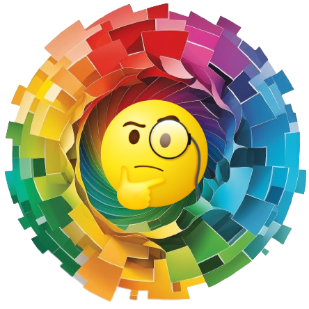
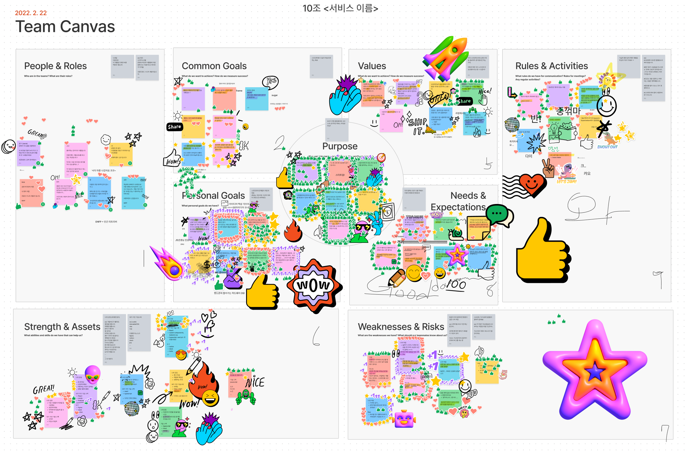
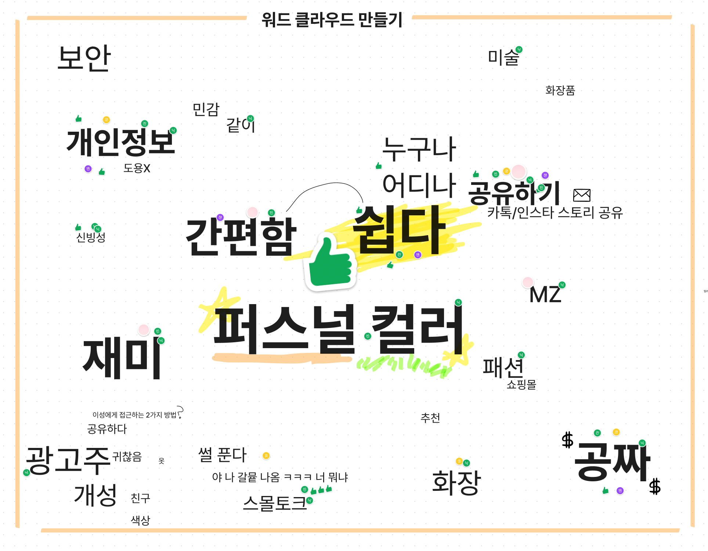
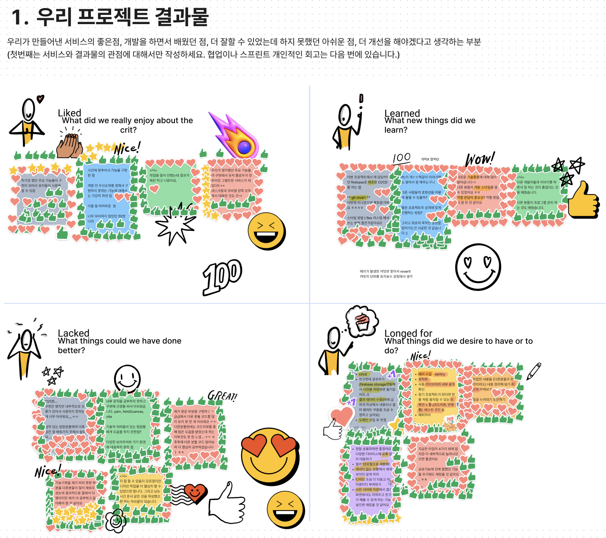

<p align="center">
  <a href="https://omct.web.app/" rel="noopener" target="_blank"></a>
</p>

<h1 align="center">오빠! 톤 많아?</h1>

## 🧐 About Project

_오빠! 톤 많아? 퍼스널 컬러 자가진단_

<p>
안녕하세요. 색깐다입니다.

내 퍼스널 컬러는 뭘까? 한 번쯤 궁금한 적 있지 않나요?<br>
하지만 퍼스널 컬러 진단 받으러 가려면 비싸고... 귀찮죠.<br>
내 사진 한 장으로 직접! 비용 없이 빠르고 간편하게! 나의 퍼스널 컬러를 찾아보아요.

</p>

> 배포 링크: https://omct.web.app/

> Github 링크: https://github.com/SaekKkanDa/OppaManyColorTone

## ✨ Installation

```sh
nvm use
yarn install
yarn run dev
```

## 📙 Guide

[0 - 에러 핸들링 디자인](https://github.com/SaekKkanDa/OppaManyColorTone/wiki/%EC%97%90%EB%9F%AC-%ED%95%B8%EB%93%A4%EB%A7%81-%EB%94%94%EC%9E%90%EC%9D%B8)

## 🙏 Contributors

<!-- ALL-CONTRIBUTORS-LIST:START - Do not remove or modify this section -->
<table>
  <tbody>
    <tr>
      <td align="center" valign="top">
        <a href="https://github.com/Jaenk-99">
          
          <br />
          <sub>
            <b>잰크</b>
          </sub>
        </a>
        <br />
      </td>
      <td align="center" valign="top">
        <a href="https://github.com/seoltang">
          
          <br />
          <sub>
            <b>설탕</b>
          </sub>
        </a>
        <br />
      </td>
      <td align="center" valign="top">
        <a href="https://github.com/jjsk109">
          
          <br />
          <sub>
            <b>닉</b>
          </sub>
        </a>
        <br />
      </td>
      <td align="center" valign="top">
        <a href="https://github.com/zwonkim">
          
          <br />
          <sub>
            <b>코코</b>
          </sub>
        </a>
        <br />
      </td>
      <td align="center" valign="top">
        <a href="https://github.com/hyeongjun3">
          
          <br />
          <sub>
            <b>준</b>
          </sub>
        </a>
        <br />
      </td>
    </tr>
  </tbody>
</table>

_Special thanks to [수야](https://github.com/soojjung)_

<!-- ALL-CONTRIBUTORS-LIST:END -->

## 🛠 Stack

- TypeScript
- React
- styled-components
- Recoil
- Firebase

## 🏃🏻 Sprint

### 1일차

- 프로젝트 아이디어 선정
- 팀 빌딩



### 2일차

- 아이디어를 바탕으로 서비스의 목적, 대상, 가치 논의
- 워드 클라우드




### 3일차

- 스케치
- BDD & SDD


### 4~5일차

- 개발

### 6일차

- 기능 테스트
- 4LS 회고


