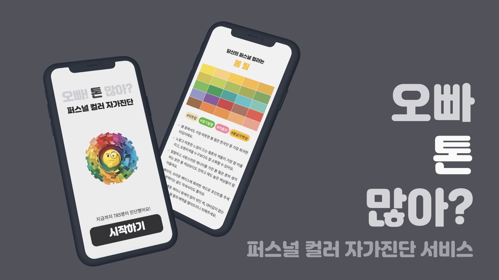
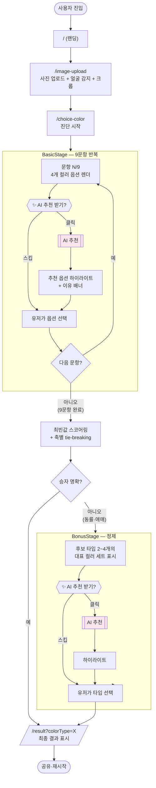

<p align="center">
  <a href="https://omct.web.app/" rel="noopener" target="_blank"></a>
</p>

# 오빠! 톤 많아?

## 🧐 About Project

_오빠! 톤 많아? 퍼스널 컬러 자가진단_

<p>
안녕하세요. 색깐다입니다.

내 퍼스널 컬러는 뭘까? 한 번쯤 궁금한 적 있지 않나요?<br>
하지만 퍼스널 컬러 진단 받으러 가려면 비싸고... 귀찮죠.<br>
내 사진 한 장으로 직접! 비용 없이 빠르고 간편하게! 나의 퍼스널 컬러를 찾아보아요.

</p>

> 배포 링크: https://omct.web.app/

> Github 링크: https://github.com/SaekKkanDa/OppaManyColorTone

## 🗺 서비스 흐름

랜딩부터 결과 페이지까지의 전체 사용자 여정. 각 문항에서 AI 추천은 옵션이며 스킵 가능.


```mermaid
flowchart TD
  Start([사용자 진입]) --> Landing["/ (랜딩)"]
  Landing --> Upload["/image-upload<br/>사진 업로드 + 얼굴 감지 + 크롭"]
  Upload --> Choice["/choice-color<br/>진단 시작"]

  subgraph Basic["BasicStage — 9문항 반복"]
    direction TB
    BQ[문항 N/9<br/>4개 컬러 옵션 렌더]
    BQ --> BAI{{✨ AI 추천 받기?}}
    BAI -- 클릭 --> BAIFlow[[AI 추천]]
    BAI -- 스킵 --> BPick[유저가 옵션 선택]
    BAIFlow --> BHilite["추천 옵션 하이라이트<br/>+ 이유 배너"]
    BHilite --> BPick
    BPick --> BNext{다음 문항?}
    BNext -- 예 --> BQ
  end

  Choice --> Basic
  BNext -- 아니오<br/>(9문항 완료) --> Score[최빈값 스코어링<br/>+ 축별 tie-breaking]
  Score --> Winner{승자 명확?}

  Winner -- 아니오<br/>(동률·애매) --> Bonus
  Winner -- 예 --> Result

  subgraph Bonus["BonusStage — 정제"]
    direction TB
    BoQ["후보 타입 2~4개의<br/>대표 컬러 세트 표시"]
    BoQ --> BoAI{{✨ AI 추천 받기?}}
    BoAI -- 클릭 --> BoAIFlow[[AI 추천]]
    BoAI -- 스킵 --> BoPick[유저가 타입 선택]
    BoAIFlow --> BoHilite[하이라이트]
    BoHilite --> BoPick
  end

  Bonus --> BoPick
  BoPick --> Result[/"/result?colorType=X<br/>최종 결과 표시"/]
  Result --> Share([공유·재시작])

  style BAIFlow fill:#fce4ec
  style BoAIFlow fill:#fce4ec
```

> AI 추천 세부 (프롬프트·모델 라우팅·레이트 리밋 등) 는 [docs/domain/ai-color-recommendation.md](./docs/domain/ai-color-recommendation.md) 참조.

## ✨ Installation

```bash
nvm use
yarn
yarn run dev
```

## 📙 Guide

- [1 - 에러 핸들링 디자인](https://github.com/SaekKkanDa/OppaManyColorTone/wiki/1.-%EC%97%90%EB%9F%AC-%ED%95%B8%EB%93%A4%EB%A7%81-%EB%94%94%EC%9E%90%EC%9D%B8)
- [2 - Github Actions을 활용하여 배포 자동화](https://github.com/SaekKkanDa/OppaManyColorTone/wiki/2.-Github-Actions%EC%9D%84-%ED%99%9C%EC%9A%A9%ED%95%98%EC%97%AC-%EB%B0%B0%ED%8F%AC-%EC%9E%90%EB%8F%99%ED%99%94)
- [3 - OMCT 폴더 구조](https://github.com/SaekKkanDa/OppaManyColorTone/wiki/3.-OMCT-%ED%8F%B4%EB%8D%94-%EA%B5%AC%EC%A1%B0)
- [4 - 다국어 지원 (next‐i18next)](<https://github.com/SaekKkanDa/OppaManyColorTone/wiki/4.-%EB%8B%A4%EA%B5%AD%EC%96%B4-%EC%A7%80%EC%9B%90-(next%E2%80%90i18next)>)

## 🙏 Contributors

<!-- ALL-CONTRIBUTORS-LIST:START - Do not remove or modify this section -->
<table>
  <tbody>
    <tr>
      <td align="center" valign="top">
        <a href="https://github.com/Jaenk-99">
          
          <br />
          <sub>
            <b>잰크</b>
          </sub>
        </a>
        <br />
      </td>
      <td align="center" valign="top">
        <a href="https://github.com/seoltang">
          
          <br />
          <sub>
            <b>설탕</b>
          </sub>
        </a>
        <br />
      </td>
      <td align="center" valign="top">
        <a href="https://github.com/jjsk109">
          
          <br />
          <sub>
            <b>닉</b>
          </sub>
        </a>
        <br />
      </td>
      <td align="center" valign="top">
        <a href="https://github.com/zwonkim">
          
          <br />
          <sub>
            <b>코코</b>
          </sub>
        </a>
        <br />
      </td>
      <td align="center" valign="top">
        <a href="https://github.com/hyeongjun3">
          
          <br />
          <sub>
            <b>준</b>
          </sub>
        </a>
        <br />
      </td>
      <td align="center" valign="top">
        <a href="https://github.com/soojjung">
          
          <br />
          <sub>
            <b>수야</b>
          </sub>
        </a>
        <br />
      </td>
    </tr>
  </tbody>
</table>

<!-- ALL-CONTRIBUTORS-LIST:END -->

## 🛠 Stack

- Next.js
- TypeScript
- styled-components
- Recoil
- Firebase
- Github actions
- Sentry
- spline
- i18next

## 🧑‍💼 담당 역할

### [설탕](https://github.com/seoltang)

- [Javascript -> Typescript 마이그레이션🔗](https://github.com/SaekKkanDa/OppaManyColorTone/pull/112)

- [React -> Next.js 마이그레이션🔗](https://github.com/SaekKkanDa/OppaManyColorTone/pull/165)

- UI/UX 설계 및 개선

- 공통 컴포넌트 개발

- [컬러 선택에 따른 결과 도출 로직 작성🔗](https://github.com/SaekKkanDa/OppaManyColorTone/pull/125)

- [SEO 개선🔗](https://github.com/SaekKkanDa/OppaManyColorTone/pull/247)

- [CLS 최적화🔗](https://github.com/SaekKkanDa/OppaManyColorTone/pull/231)

- [Next.js 이미지 및 폰트 최적화🔗](https://github.com/SaekKkanDa/OppaManyColorTone/pull/231)

- 3D 이미지 적용  
  랜딩 페이지에 3D 이미지 추가 (Spline 라이브러리 활용)

### [코코](https://github.com/zwonkim)

- 컬러 선택 로직  
  퍼스널 컬러 진단 서비스의 핵심 기능인 컬러 선택 로직 설계 및 구현
- [다국어 서비스 도입🔗](https://github.com/SaekKkanDa/OppaManyColorTone/pull/226)  
  서비스의 글로벌 확장 가능성을 염두하여, 해외 사용자들도 쉽게 접근할 수 있도록 다국어 지원 추가

- [컬러칩 선택 인터렉션 추가🔗](https://github.com/SaekKkanDa/OppaManyColorTone/issues/264)  
  사용자의 중간 이탈율을 줄이기 위하여, 컬러 선택 과정에 애니메이션을 추가하여 서비스의 몰입도를 향상

### [수야](https://github.com/soojjung)

- 퍼스널컬러 관련 아이디어 제공  
  퍼스널컬러 12타입으로 확장, 타입 별 컬러 초이스 및 설명 텍스트 작업

- [다국어 지원🔗](<https://github.com/SaekKkanDa/OppaManyColorTone/wiki/4.-%EB%8B%A4%EA%B5%AD%EC%96%B4-%EC%A7%80%EC%9B%90-(next%E2%80%90i18next)>)  
  다국어 지원 라이브러리 교체 (next-i18next)

- [SEO 메타 태그🔗](https://github.com/SaekKkanDa/OppaManyColorTone/pull/247)

### [준](https://github.com/hyeongjun3)

- [SVG를 이용한 인터렉션 개발🔗](https://github.com/SaekKkanDa/OppaManyColorTone/issues/167)  
  주로 사용하는 lottie 혹은 애니메이션 라이브러리가 아닌 svg를 직접 제어하는 인터렉션 개발

- Firebase 통신 모듈  
  firebase storage 혹은 API와 통신할 수 있는 모듈 개발

- [퍼스널 컬러 대리 테스트 기능🔗](https://github.com/SaekKkanDa/OppaManyColorTone/issues/217)  
  나의 이미지를 타인이 대신 테스트 할 수 있는 기능 개발

- [CI/CD🔗](https://github.com/SaekKkanDa/OppaManyColorTone/wiki/2.-Github-Actions%EC%9D%84-%ED%99%9C%EC%9A%A9%ED%95%98%EC%97%AC-%EB%B0%B0%ED%8F%AC-%EC%9E%90%EB%8F%99%ED%99%94)  
  firebase CLI와 github acionts을 이용하여 CI/CI 파이프라인 구축

- [코딩 컨벤션 개발🔗](https://github.com/SaekKkanDa/OppaManyColorTone/wiki/3.-OMCT-%ED%8F%B4%EB%8D%94-%EA%B5%AC%EC%A1%B0)

- [에러 핸들링 디자인🔗](https://github.com/SaekKkanDa/OppaManyColorTone/wiki/1.-%EC%97%90%EB%9F%AC-%ED%95%B8%EB%93%A4%EB%A7%81-%EB%94%94%EC%9E%90%EC%9D%B8)  
  핸들링 될 수 있는 에러는 상황에 맞게 핸들링 하며, 그렇지 못한 에러는 sentry에 규약에 맞게 에러 수집을 하는 구조 설계

## 🐞트러블 슈팅

- [html2canvas 라이브러리 저장 이슈🔗](https://github.com/SaekKkanDa/OppaManyColorTone/issues/221)  
  결과 이미지 저장 시 연예인 사진이 꺠지는 이슈

- i18next, firebase cli 사용하여 배포시 internal server error가 발생하는 이슈  
  추후 문서 제작 예정

- 크로스 브라우징 이슈  
  Native Share API, html 이미지로 저장 등 디바이스/브라우저별로 다르게 동작하는 이슈

## 📌 개선점 (TODO)

### 구글 애드센스

- 서비스 사용화 및 수익 창출
- UX에 자연스럽게 녹아드는 광고 개시

### 구글 태그 매니저

- CDP
- 사용자 행동 데이터 수집 및 데이터에 기반한 UI/UX 개선

### UX 개선

- 컬러 선택 타인 공유 링크의 랜딩 페이지 추가
- 사용자 데이터에 기반하여 이탈률 감소를 위한 개선
