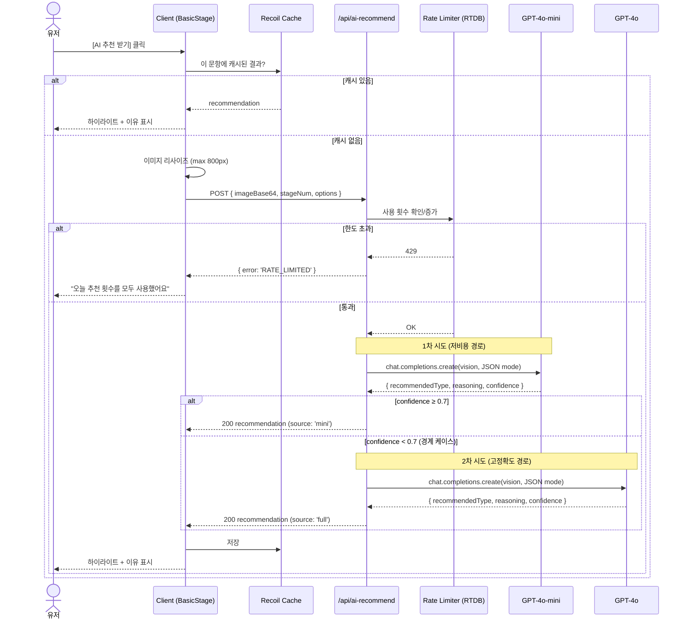
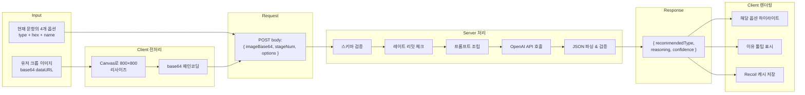
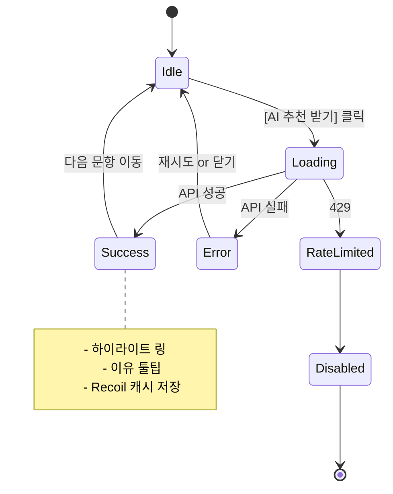

# AI 색상 추천 기능 설계 문서

> 메인 스테이지(9문항)에서 유저가 4개 컬러 옵션 사이에서 고민할 때, 선택적으로 **OpenAI GPT‑4o Vision** 기반 추천을 받아볼 수 있도록 하는 기능의 설계 문서.

- **작성일**: 2026-07-02
- **모델**: OpenAI **GPT‑4o‑mini (1차) + GPT‑4o (폴백)** — 하이브리드 라우팅
- **상태**: 설계 초안 (구현 착수 전 리뷰 필요)

---

## 1. 목적 (Purpose)

### 1.1 문제
- 4개 컬러가 서로 유사할 때 유저가 고민하며 이탈하거나 무작위로 선택함
- 사진 기반 정량적 판단이 부재 → 자가 진단의 신뢰도 낮음
- 결과의 정확도가 유저 선택에만 의존

### 1.2 목표
- 유저가 원할 때만 표시되는 **비강제적 AI 조언** 제공
- 기존 자가 진단 흐름을 방해하지 않음 (참고용, opt‑in)
- 결과 신뢰도 향상 및 이탈률 감소

### 1.3 비목표 (Non‑goals)
- AI가 유저 선택을 대체하지 않음 (최종 선택은 언제나 유저)
- AI 추천만으로 최종 컬러 타입을 결정하지 않음
- 실시간 카메라 스트림 처리 (업로드된 이미지만 사용)

---

## 2. 사용자 스토리 (User Story)

```
As 진단 중인 유저,
When 문항의 4개 컬러 중 결정하기 어려울 때,
I want "AI 추천 받기" 버튼을 눌러 참고 의견을 받고 싶다.
So that 좀 더 확신을 갖고 선택할 수 있다.
```

**받아들임 기준 (Acceptance Criteria)**
- 유저는 언제든 AI 추천 없이 진단 진행 가능
- 첫 사용 시 데이터 전송에 대한 명시적 동의 필요
- 추천 결과는 하이라이트 + 짧은 이유(1‑2문장) 형태
- 문항당 1회 캐시됨 (재클릭 시 API 재호출 안 함)
- 세션/IP별 사용 횟수 제한 존재

---

## 3. 아키텍처 개요 (Architecture Overview)

### 3.1 컴포넌트 다이어그램

```mermaid
graph TB
  subgraph Client["Client (Next.js Page Router)"]
    UI[BasicStage UI]
    AIB[AI 추천 버튼 컴포넌트]
    Cache[Recoil: aiRecommendCache]
    Consent[동의 모달]
  end

  subgraph Server["Server (Next.js API Route on Firebase Functions)"]
    API[/pages/api/ai-recommend]
    RL[Rate Limiter]
    OAI[OpenAI SDK Wrapper]
  end

  subgraph External["External"]
    OpenAI[OpenAI GPT-4o Vision API]
  end

  subgraph Firebase["Firebase"]
    RTDB[(Realtime DB)]
    Secrets[(Functions Secret Manager)]
  end

  UI -- 사진, 4옵션 --> AIB
  AIB -- POST --> API
  API --> RL
  RL --> RTDB
  API --> OAI
  OAI --> OpenAI
  OpenAI --> OAI
  OAI --> API
  API --> AIB
  AIB --> Cache
  AIB --> UI
  API -.읽기.-> Secrets
```

### 3.2 배포 아키텍처

- **정적 리소스**: Firebase Hosting (기존)
- **SSR / API Routes**: Firebase Cloud Functions (기존 `webframeworks` 실험 기능)
- **API 키 보관**: Firebase Functions Secret Manager (`OPENAI_API_KEY`)
- **레이트 리밋 스토리지**: 기존 Firebase Realtime Database (`omctDb` 확장)

새로운 인프라 구성 요소는 없음. 기존 인프라 위에 API 라우트만 추가.

---

## 4. 상세 플로우

### 4.1 시퀀스 다이어그램 (Happy Path, 하이브리드 라우팅)



**하이브리드 라우팅 정책**
- **1차: GPT‑4o‑mini** — 저비용/저지연 경로. 대부분의 명확한 케이스는 여기서 종결
- **2차: GPT‑4o** — mini의 `confidence < 0.7` 일 때만 승격. 경계 케이스 정확도 확보
- **임계값(0.7) 조정**: 실제 사용 데이터로 A/B 튜닝
- **폴백 실패 시**: mini 응답 그대로 반환 (유저 경험 최소한 유지)

### 4.2 데이터 흐름 (Data Flow)



### 4.3 상태 다이어그램 (Client UI)

암묵 동의 정책 채택으로 인해 별도 Consent 상태 없음. 개인정보처리방침에만 명시.



---

## 5. 기술 스택

| 영역 | 기술 | 비고 |
| --- | --- | --- |
| **AI 모델 (1차)** | OpenAI **GPT‑4o‑mini** (`gpt-4o-mini-2024-07-18`) | 비용/속도 유리, 대부분 케이스 처리 |
| **AI 모델 (폴백)** | OpenAI **GPT‑4o** (`gpt-4o-2024-08-06`) | mini의 confidence < 0.7 시 승격 |
| **SDK** | `openai` npm 패키지 (v4+) | 공식 |
| **런타임** | Next.js API Route (Node.js) | Firebase Functions로 배포됨 (`webframeworks`) |
| **비밀 관리** | Firebase Functions Secret Manager | `OPENAI_API_KEY` |
| **레이트 리밋 스토리지** | Firebase Realtime Database (기존 `omctDb`) | 세션/IP 카운터 |
| **클라이언트 상태** | Recoil (기존) | `aiRecommendCacheAtom`, `aiRecommendUsageAtom` |
| **이미지 리사이즈** | 브라우저 Canvas API | 서버 트래픽 최소화 |
| **국제화** | `next-i18next` (기존) | ko/en 문구 |

### 5.1 신규 의존성
```json
{
  "dependencies": {
    "openai": "^4.60.0"
  }
}
```

### 5.2 대안 검토

| 옵션 | 장점 | 단점 |
| --- | --- | --- |
| GPT‑4o‑mini + GPT‑4o 하이브리드 **(선택)** | 평균 비용/지연 최소화 + 경계 케이스 정확도 확보 | 구현 복잡도 소폭 상승, 임계값 튜닝 필요 |
| GPT‑4o 단독 | 최고 정확도, 구현 단순 | 항상 최대 비용 발생 |
| GPT‑4o‑mini 단독 | 최저 비용/최고 속도 | 경계 케이스 정확도 리스크 |
| GPT‑4.1 | 최고 정확도 | 비용 높음, 속도 느림 |
| 온디바이스 (TFJS 등) | 프라이버시 강점, 무료 | 정확도↓, 번들 커짐 |

**결론**: **하이브리드 라우팅** 채택.
- 1차 mini로 저비용 처리 → confidence ≥ 0.7 이면 그대로 반환
- confidence < 0.7 시 GPT‑4o로 승격 → 정확도 확보
- 실사용 데이터로 임계값 A/B 튜닝
- 폴백률(2차 호출 비율) 모니터링 → 20% 이상이면 프롬프트/모델 재검토

---

## 6. API 설계

### 6.1 엔드포인트
```
POST /api/ai-recommend
```

### 6.2 Request

```ts
type AiRecommendRequest = {
  imageBase64: string;         // "data:image/jpeg;base64,..." 또는 순수 base64
  stageNum: number;            // 0-8, 현재 문항 번호 (캐시/디버깅용)
  options: Array<{
    type: ColorType;           // 'springwarm' | 'summercool' | ...
    color: string;             // '#ff6448' 같은 hex
    name: string;              // 사람이 읽을 수 있는 색 이름 (선택, 디버깅용)
  }>;
  sessionId: string;           // 클라이언트 발급 UUID, 레이트 리밋용
};
```

### 6.3 Response

**200 성공**
```ts
type AiRecommendResponse = {
  recommendedType: ColorType;
  reasoning: string;           // 1-2 문장의 한국어(또는 요청 locale)
  confidence: number;          // 0.0 - 1.0 (최종 반환 모델의 confidence)
  usageRemaining: number;      // 이 세션에서 남은 요청 수
  source: 'mini' | 'full';     // 어떤 모델이 최종 응답했는지 (관찰용)
};
```

**4xx / 5xx 에러**
```ts
type AiRecommendError = {
  error:
    | 'INVALID_INPUT'         // 400
    | 'RATE_LIMITED'          // 429
    | 'AI_UNAVAILABLE'        // 502 (OpenAI 장애)
    | 'INTERNAL_ERROR';       // 500
  message: string;
  retryAfterSeconds?: number;  // 429일 때
};
```

### 6.4 프롬프트 (초안)

**System Message**
```
You are a professional Korean personal color consultant.

Given a user's face photo and 4 color candidates, choose which single color
best suits the person based on their skin undertone, eye color, and hair color.

You MUST respond with a JSON object matching this schema exactly:
{
  "recommendedType": string,   // one of the provided option types, verbatim
  "reasoning": string,          // 1-2 sentences in Korean
  "confidence": number          // 0.0 - 1.0
}

Do NOT include any text outside the JSON object.
```

**User Message**
```
[image_url or base64 image]

옵션:
[
  { "type": "springwarm", "color": "#ff6448", "name": "봄 웜" },
  { "type": "summercool", "color": "#1cace1", "name": "여름 쿨" },
  ...
]

가장 어울리는 하나를 골라주세요.
```

### 6.5 OpenAI SDK 호출 예시 (하이브리드 라우팅)

```ts
const CONFIDENCE_THRESHOLD = 0.7;

async function callModel(model: string, dataUri: string, options: Option[]) {
  const completion = await openai.chat.completions.create({
    model,
    response_format: { type: 'json_object' },
    messages: [
      { role: 'system', content: SYSTEM_PROMPT },
      {
        role: 'user',
        content: [
          { type: 'image_url', image_url: { url: dataUri, detail: 'low' } },
          { type: 'text', text: buildOptionsText(options) },
        ],
      },
    ],
    max_tokens: 200,
    temperature: 0.3,
  });
  return parseAndValidate(completion.choices[0].message.content);
}

async function getRecommendation(dataUri: string, options: Option[]) {
  // 1차: mini
  const miniResult = await callModel('gpt-4o-mini-2024-07-18', dataUri, options);

  if (miniResult.confidence >= CONFIDENCE_THRESHOLD) {
    return { ...miniResult, source: 'mini' as const };
  }

  // 2차: full (경계 케이스만 승격)
  try {
    const fullResult = await callModel('gpt-4o-2024-08-06', dataUri, options);
    return { ...fullResult, source: 'full' as const };
  } catch (err) {
    // 폴백 실패 시 mini 응답 그대로 반환 (유저 경험 최소한 유지)
    console.error('Full model fallback failed', err);
    return { ...miniResult, source: 'mini' as const };
  }
}
```

**공통 옵션**
- `detail: 'low'` → 토큰 절감 (얼굴 형태만 인식하면 충분)
- `temperature: 0.3` → 재현성 확보
- `response_format: { type: 'json_object' }` → JSON 강제

**관찰 지표 (Sentry/Firebase Analytics로 기록)**
- 총 요청 중 폴백 발생률
- mini/full 각각의 평균 지연
- confidence 히스토그램 (임계값 튜닝용)

---

## 7. UI/UX 설계

### 7.1 배치

BasicStage의 4 컬러 그리드 하단, 진행 인디케이터 위에 배치.

```
┌─────────────────────┐
│    문항 텍스트      │
├──────┬──────┬───────┤
│  🎨   │  🎨   │  🎨   │  ← 4개 컬러 옵션
├──────┼──────┼───────┤
│  🎨   │       │       │
├──────┴──────┴───────┤
│  ✨ AI 추천 받기     │  ← 새 요소 (텍스트 링크 스타일)
├─────────────────────┤
│ ● ● ● ○ ○ ○ ○ ○ ○  │  ← 진행 인디케이터
└─────────────────────┘
```

### 7.2 상태별 UI

| 상태 | 표시 |
| --- | --- |
| **Idle** | `✨ AI 추천 받기` (회색 텍스트 링크) |
| **Loading** | 스피너 + "AI가 분석 중..." (2‑7초) |
| **Success** | 추천 옵션에 반짝이는 링 애니메이션 + 하단 툴팁 "AI 추천: [이유]" |
| **Error** | 스낵바 "지금은 추천을 받을 수 없어요" + 재시도 링크 |
| **RateLimited** | 버튼 비활성화 + "오늘 사용 가능 횟수를 모두 사용했어요" |

> 별도 동의 모달 없음. 개인정보처리방침에 명시된 내용에 대한 암묵 동의로 처리.

### 7.3 하이라이트 애니메이션

- 선택된 옵션 컬러 원 주위에 CSS `box-shadow` + `keyframes` 로 부드러운 pulse
- 접근성: `prefers-reduced-motion` 존중해 애니메이션 off

### 7.4 다국어

- 신규 번역 키 (ko/en 동시 첫 릴리즈):
  - `aiRecommend.button`
  - `aiRecommend.loading`
  - `aiRecommend.error.generic`
  - `aiRecommend.error.rateLimited`
  - `aiRecommend.result.prefix`

> 동의 모달 미채택. Consent 관련 키 없음.

---

## 8. 프라이버시 & 준수사항

### 8.1 데이터 처리 원칙
- **최소 수집**: 얼굴 사진만 전송, 이름/이메일 등 PII 미포함
- **즉시 폐기**: 서버 응답 후 이미지 메모리에서 즉시 폐기, 파일/로그 저장 금지
- **로그 정책**: 이미지·base64 절대 로깅 금지. 메타데이터(요청 timestamp, session hash, latency, tokens)만 기록
- **저장 없음**: RTDB에는 카운터만 저장, 이미지·응답 텍스트 미저장

### 8.2 OpenAI 데이터 정책
- OpenAI API는 기본적으로 학습에 사용되지 않음 (2023년 3월 이후)
- 30일 abuse monitoring 로그는 존재. Enterprise 계약 시 Zero Data Retention 옵션 가능
- 개인정보처리방침에 "얼굴 사진이 OpenAI로 전송되어 분석에 사용됩니다"를 명시할 것

### 8.3 동의 절차 (암묵 동의)
- 별도 모달 없음 — UX 매끄러움 우선
- **개인정보처리방침에 명시**:
  - "AI 색상 추천 기능 사용 시 사용자가 업로드한 얼굴 이미지가 OpenAI(gpt‑4o‑mini / gpt‑4o) API로 전송됩니다"
  - "이미지는 서버 측에서 응답 후 즉시 폐기되며, 저장되지 않습니다"
  - "OpenAI는 API 데이터를 학습에 사용하지 않으며, abuse monitoring 목적의 30일 로그가 존재할 수 있습니다"
- AI 추천 버튼 근처에 개인정보처리방침 링크 노출 (`i` 아이콘 등 subtle 표시) — 유저가 원할 때 언제든 확인 가능
- 향후 GDPR/EU 트래픽 대응 시 명시적 동의 모달 재도입 검토

**리스크 인식**
- 암묵 동의는 UX 편의성 우선. 대한민국 개인정보보호법 관점에서는 처리방침 명시로 충분하나, EU/UK 유저 대응에서는 GDPR 명시적 동의 요구될 수 있음
- 글로벌 확장 시 CMP 도입 검토 필요 (AdSense 승인 프로세스에서도 이미 CMP 세팅 완료됨 — 재활용 가능)

---

## 9. 비용 & 성능 견적

### 9.1 토큰당 비용 (GPT‑4o 기준, 2026-07 기준)
- Input: $2.50 / 1M tokens
- Output: $10.00 / 1M tokens
- Vision (`low` detail): 이미지당 ~85 tokens

### 9.1.b GPT‑4o‑mini 가격
- Input: **$0.15** / 1M tokens
- Output: **$0.60** / 1M tokens
- 이미지 토큰 계산은 4o와 동일

### 9.2 요청당 추정
| 항목 | 토큰 |
| --- | --- |
| System prompt | ~120 |
| Image (low detail) | ~85 |
| Options JSON | ~150 |
| Output | ~100 |
| **합계** | ~455 tokens |

**단일 호출당 비용**
- mini 단독: **~$0.0001** (약 0.15원)
- full 단독: **~$0.0015** (약 2원)

**하이브리드 평균 (폴백률 20% 가정)**
- 평균 비용: `0.8 × $0.0001 + 0.2 × ($0.0001 + $0.0015)` = **~$0.0004** (약 0.6원)
- 4o 단독 대비 **약 73% 절감**, mini 단독 대비 4배 증가 (그러나 정확도 확보)

### 9.3 월간 예산 시나리오 (하이브리드 + 관대 레이트 리밋 기준)

**설정된 알람 임계값**: **$30/월** (기대 시나리오 대비 약 2.3배 여유)

**레이트 리밋**: 세션당 9회 / IP 일일 30회 → 상한 시나리오의 세션당 요청 가정 상향

| 시나리오 | DAU | AI 사용률 | 세션당 요청 (평균) | 월 요청 | 월 비용 (하이브리드) | 알람 상태 | 참고: 4o 단독 |
| --- | --- | --- | --- | --- | --- | --- | --- |
| 보수적 | 500 | 15% | 1.5 | ~3,400 | **~$1.5** | 🟢 안전 (5%) | ~$5 |
| 기대 | 2,000 | 25% | 2.5 | ~37,500 | **~$16** | 🟢 안전 (53%) | ~$56 |
| 상한 (관대 리밋 소진) | 5,000 | 40% | 6.0 | ~360,000 | **~$160** | 🔴 초과 (533%) | ~$540 |

- 폴백률 20%는 초기 가정. 실 데이터로 재보정 필요.
- 관대 레이트 리밋(세션당 9회) 채택으로 인해 **상한 시나리오의 위험이 이전보다 커짐** (평균 요청 3 → 6으로 상향).
- **대응 방안**:
  1. 알람 트리거 시 즉시 `NEXT_PUBLIC_ENABLE_AI_RECOMMEND=false` 로 재배포 → 기능 OFF
  2. 또는 문서 Section 5의 `CONFIDENCE_THRESHOLD` 하향 조정으로 폴백률 감소 (예: 0.7 → 0.5)
  3. 또는 레이트 리밋 축소 (세션당 9 → 3)

### 9.4 응답 시간

| 시나리오 | 서버 지연 (p50 → p95) | 총 사용자 체감 |
| --- | --- | --- |
| mini만으로 종결 (80%) | 1.5 → 3초 | **2‑3.5초** |
| mini → 4o 폴백 (20%) | 3.5 → 7초 | **4‑7.5초** |
| 평균 (0.8×mini + 0.2×hybrid) | ~2초 | **~2.5‑4.5초** |

- 클라이언트 리사이즈: <500ms
- 로딩 UI 필수 (폴백 시 최대 7초 대기 가능성)

---

## 10. 구현 마일스톤

### Phase 0 — 검증 (0.5일)
- 로컬 스크립트로 OpenAI API에 이미지 3‑5장 수동 요청
- 프롬프트 정확도 튜닝
- 응답 JSON 파싱 안정성 확인

### Phase 1 — 백엔드 (1‑2일)
- [ ] `openai` 패키지 설치
- [ ] `pages/api/ai-recommend.ts` 라우트 구현
- [ ] Zod 스키마로 요청/응답 검증
- [ ] **하이브리드 라우팅 로직** (`getRecommendation`: mini 호출 → confidence 판정 → 필요 시 full 폴백)
- [ ] `CONFIDENCE_THRESHOLD` 상수 및 관련 튜닝 훅
- [ ] Rate limiter (`omctDb` 확장, 세션/IP 카운터)
- [ ] `OPENAI_API_KEY` Secret 등록 (로컬 `.env.local`, Firebase Functions Secret)
- [ ] 관찰 로깅: `source`, `confidence`, `latency`, `fallbackTriggered` 를 Sentry breadcrumb에 남김
- [ ] 단위 테스트 (프롬프트 조립, 파싱, 폴백 트리거, 폴백 실패 처리)

### Phase 2 — 프론트엔드 (1‑2일)
- [ ] Recoil atoms: `aiRecommendCacheAtom`, `aiRecommendUsageAtom`
- [ ] `useAiRecommend` 훅 (요청, 캐시, 에러 처리)
- [ ] `AiRecommendButton` 컴포넌트 (상태별 UI)
- [ ] BasicStage 통합 (9문항 모두)
- [ ] 하이라이트 애니메이션 (styled‑components)
- [ ] ko + en 번역 키 동시 추가
- [ ] 개인정보처리방침 링크 노출 (버튼 근처)

### Phase 3 — 통합 & 릴리즈 (1일)
- [ ] Feature flag: **환경변수** `NEXT_PUBLIC_ENABLE_AI_RECOMMEND=true/false` (초기 off로 배포 → 준비 완료 시 on)
- [ ] Sentry 이벤트 추적 (요청 수, 에러율, 지연)
- [ ] 스테이징 배포 및 QA (사진 다양성 테스트, ko/en 스위치 확인)
- [ ] **개인정보처리방침 문구 업데이트 (담당: 수야)** — Section 8.3 문구 기반
- [ ] OpenAI 대시보드에 $30/월 예산 알람 세팅
- [ ] 프로덕션 롤아웃 (환경변수 on 배포)

### Phase 4 — 관찰 & 조정 (지속)
- 실 사용량 vs 예산 모니터링
- **폴백률 대시보드**: 폴백률이 30% 초과 시 프롬프트 재검토 또는 mini 모델 변경 검토
- **confidence 히스토그램**: 실제 분포 확인 후 임계값 0.7 재조정 (예: 0.6 또는 0.75)
- 정확도 피드백 수집 (선택적 유저 설문)
- mini vs full 결과 정성 비교 (샘플링)

**총 소요**: 3‑5일 (1인 기준, Phase 0‑3)

---

## 11. 리스크 및 대응

| 리스크 | 심각도 | 대응 |
| --- | --- | --- |
| OpenAI API 장애 | 중 | Graceful fallback: 스낵바로 안내, 진단은 계속 진행 |
| 응답이 non‑JSON | 중 | JSON mode + 파싱 실패 시 재시도 1회, 실패 시 에러 |
| 비용 폭발 | 상 | 레이트 리밋 + 세션 캐시 + 월 예산 알람 (OpenAI 대시보드) |
| 어뷰징 (봇 트래픽) | 상 | IP당 일일 제한 + Cloudflare Turnstile 등 CAPTCHA (필요시 추후) |
| 얼굴이 없는 이미지 업로드 | 중 | OpenAI 프롬프트에 "얼굴이 없으면 recommendedType='NONE' 반환" 지시 후 클라이언트에서 에러 처리 |
| 유저가 AI만 믿고 무성의 클릭 | 저 | 추천 문구를 subtle하게, "당신의 판단을 참고용으로 도와드립니다" |
| 프라이버시 이슈 | 상 | 명시적 동의, 로깅 금지, 개인정보처리방침 업데이트 |
| 다양한 인종/피부톤에서 편향 | 중 | Phase 0에서 다양한 샘플로 검증, 편향 발견 시 프롬프트 튜닝 |

---

## 12. 확장 여지

### 향후 고려 가능한 개선
- **최종 결과 페이지**: "AI가 본 당신" 코멘트 섹션
- **선택 vs AI 통계**: 유저 선택과 AI 추천 일치율 표시 (동의 기반 익명 집계)
- **온디바이스 사전 필터**: 얼굴 검출 후에만 API 호출 (비용 절감)
- **다중 AI 앙상블**: 여러 모델 결과 통합 (정확도 향상)
- **개인화 프롬프트**: 이전 선택 이력을 프롬프트에 반영
- **음성 추천**: TTS로 접근성 향상

---

## 13. 미결 사항 (Open Questions)

모든 결정 확정 (2026-07-02):

1. ✅ **모델 라우팅**: 하이브리드 (mini 1차 + full 폴백, `confidence < 0.7` 시 승격)
2. ✅ **하이브리드 임계값**: `CONFIDENCE_THRESHOLD = 0.7` — 실사용 데이터로 재조정
3. ✅ **레이트 리밋 (관대 프로파일)**:
   - 세션당 **9회** (모든 문항에서 가능)
   - IP당 일일 **30회**
   - ⚠ 상한 시나리오 비용 리스크 → Section 9.3 참조
4. ✅ **월 예산 알람**: **$30/월** (OpenAI 대시보드). 초과 시 알람 → feature flag OFF
5. ✅ **첫 릴리즈 범위**:
   - **하이라이트 + 이유 텍스트** 함께 노출
   - **9문항 모두**에서 AI 추천 버튼 노출
6. ✅ **동의 방식**: **암묵 동의** — 별도 동의 모달 없이 **개인정보처리방침에 명시**. UX 매끄러움 우선
7. ✅ **다국어**: **ko + en 동시** 첫 릴리즈부터
8. ✅ **Feature flag 방식**: **환경변수** (`NEXT_PUBLIC_ENABLE_AI_RECOMMEND`). 즉시 on/off 필요 시 재배포 감수
9. ✅ **폴백 실패 정책**: **mini 응답 반환** (유저에게 최소한의 답변 제공, `source: 'mini'`로 관찰 로그 기록)
10. ✅ **개인정보처리방침 담당**: **본인(수야)** 직접 작성 및 배포

---

## 14. 관련 파일 & 참조

### 신규 추가 예정 파일
- `src/pages/api/ai-recommend.ts` — API 라우트
- `src/hooks/useAiRecommend.ts` — 클라이언트 훅
- `src/components/AiRecommend/AiRecommendButton.tsx`
- `src/recoil/aiRecommend.ts` — Recoil atoms
- `src/utils/openaiClient.ts` — SDK wrapper (하이브리드 라우팅 포함)
- `src/utils/imageResize.ts` — 클라이언트 리사이즈
- `public/locales/{ko,en}/common.json` — 번역 키 추가 (ko/en 동시)

> `AiConsentModal` 컴포넌트 미채택 (암묵 동의 정책).

### 수정 예정 파일
- `src/pages/choice-color/BasicStage/index.tsx` — 버튼 통합
- `src/utils/omctDb.ts` — 레이트 리밋 카운터 추가
- `.env.local` / `.env.example` — 환경변수 문서화
- `.github/workflows/firebase-hosting-merge.yml` — Secret 주입 추가

### 참조
- 기존 도메인 문서: [personal-color-algorithm.md](./personal-color-algorithm.md)
- OpenAI Vision API 공식: https://platform.openai.com/docs/guides/vision
- Firebase Functions Secret Manager: https://firebase.google.com/docs/functions/config-env#secret-manager
