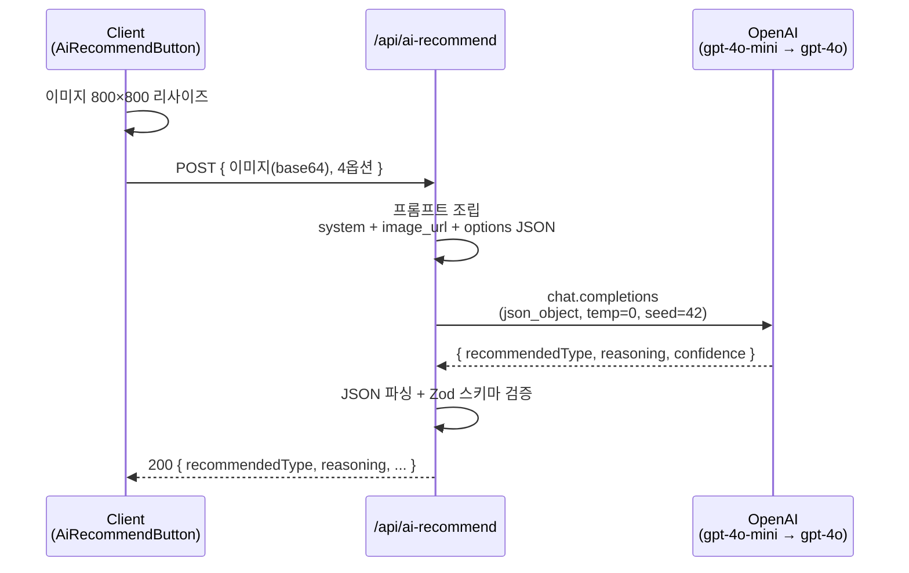

# AI 색상 추천 기능 문서

BasicStage(9문항) + BonusStage 에서 유저가 컬러 옵션 사이에서 고민할 때 선택적으로 **OpenAI GPT‑4o Vision** 기반 추천을 받을 수 있는 기능. **하이브리드 라우팅** (gpt-4o-mini 1차 + gpt-4o 폴백) 으로 비용·정확도 균형.

- **작성일**: 2026-07-02 (설계 초안)
- **최종 업데이트**: 2026-07-03 (구현 완료 + 관찰 반영)
- **상태**: 프로덕션 배포 완료, 기능 flag OFF 상태로 대기

> 서비스 전체 사용자 여정은 프로젝트 [README.md](../../README.md#-서비스-흐름) 참조. 이 문서는 AI 추천 기능만 다룸.

---

## 0. 구현 상태 및 설계 대비 변경 사항

### 0.1 현재 배포 상태

| 항목 | 값 |
| --- | --- |
| 프로덕션 배포 | ✅ 완료 (production 브랜치) |
| Feature flag | `NEXT_PUBLIC_ENABLE_AI_RECOMMEND='false'` (초기 OFF) |
| 노출 범위 | BasicStage 9문항 + BonusStage 1문항 (세션당 총 10회 상한) |
| ON 절차 | GitHub Variables → `ENABLE_AI_RECOMMEND='true'` → 재배포 |

### 0.2 설계 대비 실제 구현 차이

| 영역 | 설계 (v0) | 실제 구현 |
| --- | --- | --- |
| 레이트 리밋 스토리지 | RTDB | **Firestore + firebase-admin** (기존 `omctDb` 통일) |
| API 라우트 경로 | `ai-recommend.ts` | **`ai-recommend.page.ts`** (`pageExtensions` 확장) |
| 동의 절차 | 암묵 동의 | **명시적 동의 모달** (§4.2) |
| 노출 문항 | BasicStage 9 | **BasicStage 9 + BonusStage 1** |
| 옵션 스키마 | `{type, color, name}` | `{type, color, name?, season, tone}` |
| 재현성 | `temperature: 0.3` | `temperature: 0`, `seed: 42` |
| 실패 시 quota | 소진 | **refund 로 환원** |
| 프롬프트 | 단순 지시 | **상대 비교 프레이밍 + 언더톤 방법론 + 웜 편향 보정 + 한국인 쿨 prior + tone 축 시각 특성** |
| UI 라벨 | "AI 추천" | "이 4가지 중 AI 픽" |

각 결정의 이유는 관련 절/PR 커밋 메시지 참조.

---

## 1. 아키텍처

### 1.1 컴포넌트 다이어그램

```mermaid
graph TB
  subgraph Client["Client (Next.js Pages Router)"]
    BS[BasicStage / BonusStage UI]
    AIB[AiRecommendButton]
    Modal[AiConsentModal 스낵바]
    Hook[useAiRecommend 훅]
    Cache["Recoil atoms<br/>cache / sessionId / usageRemaining / consent"]
    Rsz[Canvas 800×800 리사이즈]
    LS[(localStorage:<br/>aiRecommendConsent)]
  end

  subgraph Server["Server (API on Firebase Cloud Functions)"]
    API[/pages/api/ai-recommend.page.ts]
    Sch[Zod 스키마 검증]
    RL["rateLimiter.ts<br/>checkAndConsume / refund"]
    OAI["openaiClient.ts<br/>하이브리드 라우팅"]
    Admin[firebase-admin<br/>ADC 자동 인증]
  end

  subgraph External["External"]
    OpenAI[OpenAI Chat Completions Vision]
  end

  subgraph Firebase["Firebase 인프라"]
    FS[(Firestore<br/>aiRecommendRateLimit)]
    GH[(GitHub Secrets:<br/>OPENAI_API_KEY)]
  end

  BS --> AIB
  AIB --> Hook
  Hook <--> Cache
  Cache <--> LS
  Hook --> Modal
  Hook --> Rsz
  Rsz -- POST --> API
  API --> Sch
  Sch --> RL
  RL <--> Admin
  Admin <--> FS
  RL --> OAI
  OAI <--> OpenAI
  API --> AIB
  GH -.env 주입.-> API
```

### 1.2 배포 아키텍처

- **정적 리소스**: Firebase Hosting (기존)
- **SSR / API Routes**: Firebase Cloud Functions v2 (`webframeworks` 실험, Node 20 런타임)
- **API 키 보관**: GitHub Actions Secrets → 배포 시 `.env` 주입
- **레이트 리밋 스토리지**: Firestore `aiRecommendRateLimit` 컬렉션 (`firebase-admin` 서버 SDK)
- **Feature flag**: GitHub Actions Variables → `NEXT_PUBLIC_ENABLE_AI_RECOMMEND`

---

## 2. API 계약

### 엔드포인트
```
POST /api/ai-recommend
```

### Request

```ts
type AiRecommendRequest = {
  imageBase64: string;   // data:image/jpeg;base64,... (5MB body limit)
  stageNum: number;      // 0-9 (9는 BonusStage)
  sessionId: string;     // 클라이언트 발급 UUID
  options: Array<{
    type: ColorType;      // 'springwarm' | 'summercool' | ...
    color: string;        // '#ff6448'
    name?: string;
    season: 'spring' | 'summer' | 'autumn' | 'winter';
    tone: 'warm' | 'cool' | 'bright' | 'mute' | 'light' | 'deep';
  }>;
};
```

### Response

**200 성공**
```ts
type AiRecommendResponse = {
  recommendedType: ColorType;
  reasoning: string;         // 1-2 문장 (상대 비교 프레이밍)
  confidence: number;        // 0.0 - 1.0
  usageRemaining: number;
  source: 'mini' | 'full';
};
```

**에러**
```ts
type AiRecommendError = {
  error: 'INVALID_INPUT'        // 400
       | 'NO_FACE_DETECTED'     // 422 (refund 수행)
       | 'RATE_LIMITED'         // 429 (Retry-After 헤더)
       | 'AI_UNAVAILABLE'       // 502 (refund 수행)
       | 'INTERNAL_ERROR';      // 500 (refund 수행)
  message: string;
  retryAfterSeconds?: number;
};
```

### 프롬프트 엔지니어링 전략

Vision 모델이 최종 진단으로 오해되지 않으면서 4개 중 하나를 신중히 골라내도록, SYSTEM_PROMPT 에 아래 규칙들을 명시적으로 삽입.

**1. 상대 비교 프레이밍 (오해 방지)**

태스크를 "당신의 톤을 판정하라" 가 아닌 "이 4가지 중 가장 어울리는 것을 골라라" 로 재정의.

- 프롬프트에 "You are NOT diagnosing their final personal color type — the 4 options are a limited subset" 명시
- reasoning 문장에 "제시된 4가지 중에서는" / "네 색 가운데" 등 상대 표현 **필수 포함** 강제
- "당신은 X톤" / "당신의 퍼스널 컬러는" 같은 진단 문구를 **금지어**로 등록

```
GOOD: "제시된 4가지 중에서는 이 색이 피부톤을 가장 맑아 보이게 하고 얼굴 윤곽도 살려줘요."
BAD:  "당신은 겨울 쿨톤이며 이 색이 가장 잘 어울립니다."
```

**2. 옵션에 구조화된 메타데이터 첨부**

라벨 문자열(`springwarm` 등) 만 넘기지 않고, 각 옵션에 `season`, `tone` 필드를 함께 전송 → AI 가 언더톤을 라벨에서 추론하는 부담 없이 구조화된 신호로 판단.

```json
{ "type": "summerlight", "color": "#f7cdd0", "season": "summer", "tone": "light" }
```

프롬프트가 시즌-언더톤 매핑을 명시: "spring/autumn imply WARM undertone; summer/winter imply COOL undertone".

**3. 언더톤 판정 방법론 (판단 근거 표준화)**

"보이는 대로 골라라" 대신 **구체적 관찰 지점**을 지정:

- **그림자 영역**: 목·귀 뒷면·턱 아래·관자놀이. 노란/골든/피치 → 웜, 핑크/장미/블루 → 쿨
- **인접 톤 조화**: 웜은 아이보리/베이지와, 쿨은 그레이/핑크와 자연스러운지
- **손목 혈관 색**: 녹색 → 웜, 청보라 → 쿨 (보이면)

**4. Warm bias 보정 + 한국인 cool prior**

두 층위의 편향이 겹쳐서 실제보다 warm 하게 판정되는 경향이 있음:
- **사진 자체가 warm 왜곡**: 카메라 자동 화이트밸런스·실내조명·beauty 필터·JPEG 압축이 대체로 노란 캐스트를 얹음
- **Vision 모델의 warm prior**: 학습 데이터가 위 왜곡을 겪은 이미지들이라 "얼굴 = 살짝 warm" 이라는 내재 편향

프롬프트에 이 두 편향을 명시하고 **borderline 케이스는 무조건 쿨로 기울이도록** 강제.

- "Photo lighting / camera white-balance / JPEG compression frequently shift skin toward yellow/warm"
- "In the Korean population, COOL undertones are demographically MORE common"
- "When ambiguous or borderline between warm and cool, ALWAYS default to the cool option"
- "Only pick a warm-season option when the warm undertone is clearly and unmistakably visible"

이 튜닝 이후 여름 라이트 유저가 봄 라이트로 오분류되던 케이스가 개선됨.

**5. Tone 축 (light/mute/bright/deep) 시각 특성 명시**

각 tone 라벨을 얼굴상 어떤 인상으로 판단해야 하는지 세부화. 특히 Light vs Mute 는 실사용에서 잦은 오분류라 별도 규칙:

- **LIGHT**: 피부가 luminous, translucent, dewy. 파스텔의 clarity.
- **MUTE**: 피부가 matte, soft-powdered, low-contrast. 흐릿한 haze.
- **BRIGHT**: 눈/헤어에 crisp definition, 얼굴이 vivid 색을 소화 가능.
- **DEEP**: 눈/헤어와 피부의 strong contrast, 짙은 색이 anchor 역할.

**6. Tone 축 bias 보정**

사진 아티팩트(저조도, 압축) 가 실제보다 mute 하게 보이게 만드는 경향 반영:

- "Borderline light vs mute → prefer LIGHT (photo artifacts more often ADD muteness than remove it)"

**7. 재현성 확보 파라미터**

- `temperature: 0` — 샘플링 랜덤성 제거
- `seed: 42` — best-effort 재현
- 같은 이미지·옵션에 대해 같은 응답을 최대한 보장 (튜닝 관찰 용이)

**8. JSON 응답 강제 + 스키마 검증**

- `response_format: { type: 'json_object' }` 로 JSON 강제
- 서버가 Zod (`aiOpenaiResponseSchema`) 로 파싱·검증
- `recommendedType` 이 실제 옵션 4개 중 하나인지 크로스체크 (환각 방지)
- 파싱 실패 → `INVALID_AI_RESPONSE`, 얼굴 없음 → `NONE` 반환 → `NO_FACE_DETECTED` 매핑 + refund

**전체 원문**: `src/utils/aiRecommend/prompt.ts` (`SYSTEM_PROMPT` 상수)

---

### 하이브리드 라우팅

1. **gpt-4o-mini** 우선 호출 (저비용, 대부분 케이스 처리)
2. `confidence < CONFIDENCE_THRESHOLD (=0.7)` 이면 gpt-4o 승격
3. gpt-4o 실패 시 mini 응답 그대로 반환 (`source: 'mini'` 유지)
4. `recommendedType === 'NONE'` 은 즉시 `NO_FACE_DETECTED` 매핑 (폴백 안 함) + refund

라우팅 로직: `src/utils/aiRecommend/openaiClient.ts` (`getRecommendation`)

공통 호출 파라미터: `response_format: json_object`, `max_tokens: 200`, `temperature: 0`, `seed: 42`, `image_url.detail: 'low'`.

---

## 3. UI/UX

### 상태별 표시

| 상태 | 트리거 | 표시 |
| --- | --- | --- |
| `idle` | 초기 | "✨ AI 추천 받기" (텍스트 링크) |
| `loading` | 요청 중 | 스피너 + "AI가 분석 중..." (평균 2‑7초) |
| `success` | 200 또는 캐시 히트 | 옵션 pulse 하이라이트 + "이 4가지 중 AI 픽: [이유]" 배너 |
| `error` | 실패 | "지금은 추천을 받을 수 없어요" or "얼굴이 잘 보이지 않아요" + 재시도 링크 |
| `rateLimited` | 429 | 비활성 + "오늘 사용 가능 횟수 모두 사용" |
| `disabled` | feature flag OFF | 렌더 안 함 |

### 하이라이트 & 접근성

- CSS `box-shadow` + `keyframes` 로 부드러운 pulse
- `prefers-reduced-motion` 존중해 애니메이션 대신 정적 outline 폴백

### i18n

`aiRecommend.*` 키가 `public/locales/{ko,en}/common.json` 에 존재.

---

## 4. 프라이버시 & 동의

### 4.1 데이터 처리 원칙

- **최소 수집**: 얼굴 사진만 전송, PII 미포함
- **즉시 폐기**: 서버 응답 후 이미지 메모리에서 폐기. 파일/로그 저장 금지
- **IP 저장**: SHA-256 해시 앞 32자리만 (레이트 리밋 목적, 원본 미저장)
- **OpenAI 정책**: API 데이터 학습 미사용, 30일 abuse-monitoring 로그 존재 가능

### 4.2 명시적 동의 모달

원 설계는 암묵 동의였으나 앱 내 개인정보처리방침 페이지 부재로 **명시적 동의 모달**로 전환.

- **컴포넌트**: `AiConsentModal.tsx` (shareModal 과 동일한 스낵바 스타일)
- **트리거**: AI 추천 버튼 최초 클릭 시. `consent === 'granted'` 아니면 요청 지연
- **저장**: `aiRecommendConsentState` Recoil atom + `localStorageEffect`. 재방문 시 재동의 불필요
- **거부 시**: 카운트 소모 없음, 재클릭 시 모달 재표시 (재고 가능)
- **모달 문구**: 이용 목적 / 전송 항목 / 전송 대상 (OpenAI gpt-4o-mini/4o) / 보유 및 이용 기간 (즉시 폐기) + OpenAI 정책 안내 + 거부 가이드

**후속 과제**: 정식 `/privacy` 페이지 신설 시 이 모달을 링크로 대체 검토.

---

## 5. 비용 & 레이트 리밋

### 5.1 단일 호출 비용

- Vision `detail: 'low'`: 이미지당 ~85 tokens
- 요청당 합계 ~455 tokens (system + image + options + output)
- mini 단독: **~$0.0001** (약 0.15원)
- full 단독: **~$0.0015** (약 2원)
- 하이브리드 평균 (폴백률 20% 가정): **~$0.0004** (약 0.6원)

### 5.2 레이트 리밋

Firestore 카운터, `refund` 로 실패 시 환원. localhost bypass.

**3층 상한** (각각 목적이 다름):

| 층위 | 상한 | 리셋 | 목적 |
| --- | --- | --- | --- |
| 세션 | 10 | 페이지 새로고침 | 진단 흐름을 완주할 수 있는 최대치 (= BasicStage 9 + BonusStage 1) |
| IP | 30/일 | UTC 자정 | 비용·어뷰징 보호의 실질 라인 (약 3세션 완주 분) |
| 월 | \$30 | OpenAI 대시보드 알람 | 최후 안전장치 → flag OFF |

- **세션 = 10** 은 "유저가 이론적으로 AI 도움을 받을 수 있는 최대 지점 수" 와 같음. `sessionId` 는 Recoil in-memory 만 사용해 새로고침 시 리셋되므로, 실질 어뷰징 방어는 IP 계층이 담당.
- 실패한 요청은 refund 되어 성공 카운트만 소진. 재시도 이중 차감 없음.
- localhost (127.0.0.1 / ::1 / localhost / unknown) 은 카운트 안 함.
- IP 초과 시 429 + `Retry-After` 헤더에 UTC 자정까지 초 반환.

### 5.3 월 예산

- **OpenAI 대시보드 hard limit: $30/월**
- 초과 시 즉시 `NEXT_PUBLIC_ENABLE_AI_RECOMMEND='false'` 재배포로 기능 OFF
- 필요 시 `CONFIDENCE_THRESHOLD` 하향(0.7→0.5)으로 폴백률 감소, 또는 세션 상한 축소

### 5.4 응답 시간

| 시나리오 | p50 → p95 |
| --- | --- |
| mini만으로 종결 (~80%) | 1.5 → 3초 |
| mini → full 폴백 (~20%) | 3.5 → 7초 |

로딩 UI 필수. 폴백 시 최대 7초 대기.

---

## 6. 리스크 & 확장

### 6.1 리스크 대응

| 리스크 | 대응 |
| --- | --- |
| OpenAI 장애 | 하이브리드 폴백 + 실패 시 refund + UI 재시도 |
| non-JSON / 스키마 불일치 | `json_object` 강제 + Zod 검증 + 옵션 포함 여부 크로스체크 |
| 비용 폭발 | 세션/IP 카운터 + 캐시 + $30/월 hard limit + flag OFF 즉시 롤백 |
| 어뷰징 | IP 제한 + SHA-256 해시 저장. 필요 시 Turnstile 후속 |
| 얼굴 없음 | 프롬프트에 `NONE` 지시 → 422 매핑 + refund |
| AI 맹신 | 프롬프트 상대 비교 프레이밍 + UI 라벨 "이 4가지 중" |
| 편향 (warm bias, light↔mute) | 프롬프트 언더톤 방법론 + 한국인 쿨 prior + tone 축 시각 특성 |
| 재시도 이중 차감 | 실패 시 refund |

### 6.2 후속 검토

- **정식 `/privacy` 페이지**: 스낵바 동의를 페이지 링크로 대체
- **BonusStage AI 재검토**: 실사용 데이터에서 유용성 낮으면 제거
- **선택 vs AI 통계**: 동의 기반 익명 집계로 일치율 노출
- **온디바이스 얼굴 검출**: 얼굴 없는 이미지 서버 호출 사전 차단
- **최종 결과 페이지 AI 코멘트**: "AI가 본 당신" 요약 문단

---

## 7. 관련 파일

### 서버측
- `src/pages/api/ai-recommend.page.ts` — API 라우트 (POST 핸들러)
- `src/utils/aiRecommend/schema.ts` — Zod 스키마
- `src/utils/aiRecommend/prompt.ts` — SYSTEM_PROMPT + `buildUserText`
- `src/utils/aiRecommend/openaiClient.ts` — 하이브리드 라우팅, `CONFIDENCE_THRESHOLD`
- `src/utils/aiRecommend/rateLimiter.ts` — `checkAndConsume`, `refund`, 상한, localhost bypass
- `src/utils/aiRecommend/adminDb.ts` — firebase-admin 초기화 (ADC / `FIREBASE_SERVICE_ACCOUNT_JSON`)
- `src/utils/aiRecommend/typeMeta.ts` — `ColorType → {season, tone}` 매핑

### 클라이언트측
- `src/hooks/useAiRecommend.ts` — 요청 훅, consent 게이트, 상태 머신
- `src/components/AiRecommend/index.tsx` — `AiRecommendButton`
- `src/components/AiRecommend/AiConsentModal.tsx` + `consentStyle.ts` — 동의 모달
- `src/components/AiRecommend/style.ts` — 버튼 스타일
- `src/recoil/aiRecommend.ts` — 4개 atom (cache / sessionId / usageRemaining / consent)
- `src/utils/imageResize.ts` — Canvas 리사이즈

### 통합 지점
- `src/pages/choice-color/BasicStage/index.tsx` — pulse 하이라이트 + 버튼
- `src/pages/choice-color/BonusStage/index.tsx` — 버튼 (`stageNum=9`)

### 설정·번역·CI
- `public/locales/{ko,en}/common.json` — `aiRecommend.*` 키
- `.env.example` — 환경변수 문서화
- `.github/workflows/firebase-hosting-merge.yml` — Secret 주입
- `next.config.js` — `pageExtensions: ['page.tsx', 'page.ts']`, `outputFileTracingIncludes`
- `tsconfig.json` — `@Root/*` 별칭

### 검증 도구
- `scripts/ai-recommend-check.ts` — 로컬 CLI (`yarn ai-recommend:check <image>`) — mini/full 응답 수동 비교

### 참조
- [personal-color-algorithm.md](./personal-color-algorithm.md) — 12타입 도메인 문서
- OpenAI Vision: https://platform.openai.com/docs/guides/vision
- Firebase webframeworks: https://firebase.google.com/docs/hosting/frameworks/nextjs

---

## 8. AI 추천 핵심 흐름

### 8.1 요청 → OpenAI → 응답



핵심 상세:
- 프롬프트 문안 & 옵션 직렬화: `src/utils/aiRecommend/prompt.ts`
- 하이브리드 라우팅 (mini → confidence → full): `src/utils/aiRecommend/openaiClient.ts` (`getRecommendation`)
- 레이트 리밋 & refund: `src/utils/aiRecommend/rateLimiter.ts`
- 동의 게이트: §4.2

### 8.2 관찰 지표

프로덕션 켠 이후 데이터 축적 시 확인:

- **폴백률** = full 호출 / 전체 요청. 20% 초과 시 프롬프트 재검토
- **confidence 히스토그램**: mini 응답의 분포. 임계값 0.7 재조정 근거
- **refund 발생률**: AI_UNAVAILABLE 지배적이면 OpenAI 계약/키 상태 점검
- **동의 거부율**: 30% 이상이면 모달 문구 재검토
- **월 예산**: OpenAI 대시보드 알람 ($30/월). 초과 시 flag OFF
